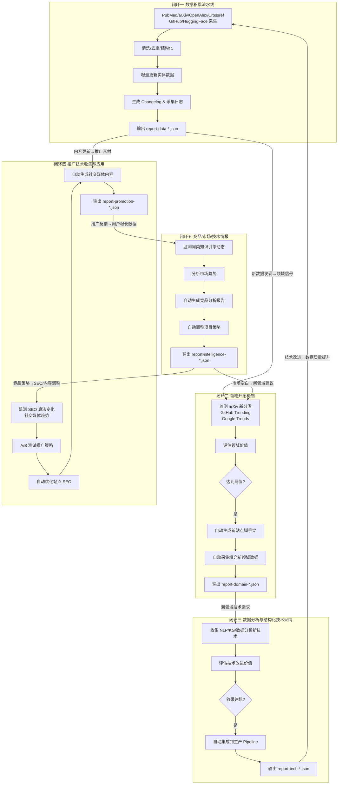

# GeneTech 14站知识引擎 — 自动化运营方案总览

## 项目概述

GeneTech 14站知识引擎是一个多领域前沿科技知识聚合平台，涵盖 14 个专业站点：

| 编号 | 站点名称 | 领域关键词 |
|------|----------|-----------|
| 01 | AI Agents | Agent、智能体、Multi-Agent |
| 02 | MCP | Model Context Protocol |
| 03 | Agent 生态 | Agent Framework、Orchestration |
| 04 | LLM | 大语言模型、Foundation Model |
| 05 | RAG | Retrieval-Augmented Generation |
| 06 | Prompt 工程 | Prompt Engineering、提示词优化 |
| 07 | 微调 | Fine-tuning、PEFT、LoRA |
| 08 | 评测 | Benchmark、Evaluation、LLM-as-a-Judge |
| 09 | 安全 | AI Safety、Alignment、Red Teaming |
| 10 | 多模态 | Multimodal、Vision-Language |
| 11 | 工具 | AI Tools、DevTools、Coding Assistant |
| 12 | 数据集 | Dataset、Data Curation、Synthesis |
| 13 | 论文 | Paper Digest、Survey、Research Trend |
| 14 | 社区 | Community、Conference、Workshop |

部署在 **Cloudflare Pages**，使用 **Node.js + Python** 进行数据采集和处理。

---

## 五闭环协作架构

本运营方案设计 **5 个核心闭环**，每个闭环均遵循：

```
信息收集 → 分析 → 决策采用 → 开发 → 测试 → 部署
```

闭环之间通过 JSON 报告文件传递状态，形成完整的自动化运营飞轮。

### 架构总览（Mermaid）



### 闭环间 JSON 报告传递机制

| 报告文件 | 生产者 | 消费者 | 传递信息 |
|---------|--------|--------|---------|
| `reports/report-data-YYYYMMDD-HHMMSS.json` | 闭环一 | 闭环二、闭环四 | 新增实体、热点标签、采集量 |
| `reports/report-domain-YYYYMMDD-HHMMSS.json` | 闭环二 | 闭环一、闭环三 | 新领域定义、技术需求、脚手架路径 |
| `reports/report-tech-YYYYMMDD-HHMMSS.json` | 闭环三 | 闭环一、闭环五 | 技术改进效果、性能指标、集成状态 |
| `reports/report-promotion-YYYYMMDD-HHMMSS.json` | 闭环四 | 闭环五 | 推广渠道效果、用户增长、SEO指标 |
| `reports/report-intelligence-YYYYMMDD-HHMMSS.json` | 闭环五 | 闭环二、闭环四 | 竞品动态、市场空白、策略建议 |

---

## 各闭环详细说明

### 闭环一：数据积累流水线（pipeline-data-accumulation.js）

**目标**：持续从多源采集前沿科技数据，确保 14 站内容新鲜、完整、结构化。

**数据源**：
- **学术论文**：PubMed、arXiv、OpenAlex、Crossref
- **开源项目**：GitHub API（stars、releases、topics）
- **模型与数据集**：HuggingFace Hub

**核心流程**：
1. **定时触发**：每日 02:00 UTC 执行，支持增量模式
2. **多源并发采集**：使用 `Promise.allSettled` 并行请求多个 API
3. **数据清洗**：去重（基于 DOI/arXiv ID/GitHub full_name）、字段标准化、缺失值填充
4. **结构化存储**：按 14 站分类体系写入 JSON/MD 实体文件
5. **增量更新**：仅处理上次采集后新增/变更的数据
6. **日志与报告**：生成结构化 changelog 和 `report-data-*.json`

**关键配置**：
```javascript
const DATA_SOURCES = {
  arxiv: { enabled: true, categories: ['cs.AI', 'cs.CL', 'cs.CV', 'cs.LG'], incremental: true },
  pubmed: { enabled: true, query: '("artificial intelligence"[Title/Abstract])', incremental: true },
  openalex: { enabled: true, concepts: ['artificial intelligence', 'natural language processing'], incremental: true },
  crossref: { enabled: true, query: 'machine learning', incremental: true },
  github: { enabled: true, topics: ['ai-agent', 'mcp', 'rag', 'llm'], incremental: true },
  huggingface: { enabled: true, tasks: ['text-generation', 'question-answering'], incremental: true }
};
```

---

### 闭环二：领域开拓机制（pipeline-domain-expansion.js）

**目标**：自动发现新兴技术领域，评估价值，并在达到阈值后自动创建新站点。

**信号来源**：
- arXiv 新分类或异常增长的现有分类
- GitHub Trending 新兴仓库（stars 增速、fork 活跃度）
- Google Trends 技术关键词搜索量变化
- 闭环五传递的市场空白信号

**评估维度**：
| 指标 | 权重 | 阈值 |
|------|------|------|
| 论文数量（月新增） | 30% | >= 50 篇 |
| GitHub 仓库增速 | 25% | >= 20 个新仓库/月 |
| 搜索趋势增长 | 20% | 搜索量增长 >= 200% |
| 社区讨论热度 | 15% | 讨论帖 >= 1000/月 |
| 与现有 14 站关联度 | 10% | 关联度 >= 0.3 |

**自动执行流程**：
1. 采集信号并计算综合得分
2. 得分 >= 阈值（默认 0.75）时触发评估
3. 自动生成新站点脚手架（目录结构、基础配置、模板文件）
4. 调用闭环一接口预填充新领域数据
5. 生成 `report-domain-*.json` 记录决策依据

---

### 闭环三：数据分析与结构化技术采纳（pipeline-tech-adoption.js）

**目标**：持续跟踪 NLP、知识图谱、数据分析领域的新技术，自动评估并集成到生产 pipeline。

**技术监测范围**：
- **NLP 新技术**：新分词器、embedding 模型、文本聚类算法
- **知识图谱**：实体链接、关系抽取、图数据库技术
- **数据分析**：异常检测、趋势预测、自动分类算法
- **数据处理**：新清洗工具、增量同步方案、向量化方案

**评估与采纳流程**：
1. 从 arXiv 论文、GitHub releases、技术博客采集候选技术
2. 在隔离环境中构建 PoC（Proof of Concept）
3. 使用历史数据集进行 A/B 测试，对比现有方案
4. 评估指标：准确率、召回率、处理速度、资源占用
5. 达标后自动修改 pipeline 代码并提交 PR（dry-run 模式下生成 patch）
6. 生成 `report-tech-*.json` 记录测试结果和集成状态

---

### 闭环四：推广技术收集与应用（pipeline-promotion.js）

**目标**：自动化 SEO 优化、社交媒体推广，提升知识引擎的可见度和用户增长。

**监测与执行模块**：
1. **SEO 算法监测**：跟踪 Google 核心更新、IndexNow 协议变化
2. **结构化数据**：自动更新 Schema.org JSON-LD 标记
3. **索引提交**：通过 IndexNow API 自动提交新/更新页面
4. **社交媒体**：自动生成 Twitter/X、LinkedIn、微信推文内容
5. **A/B 测试**：测试不同标题、描述、发布时间的推广效果

**内容生成策略**：
- 从闭环一产出的新增实体中提取热点话题
- 使用模板引擎生成多平台适配的推广文案
- 自动附加相关链接和标签

**效果追踪**：
- 生成 `report-promotion-*.json`，记录各渠道 CTR、转化率、用户增长

---

### 闭环五：竞品/市场/技术情报（pipeline-intelligence.js）

**目标**：全面监测竞品动态，分析市场趋势，自动生成策略调整建议。

**监测对象**：
- 同类知识引擎（Papers With Code、HuggingFace Papers、Arxiv Sanity Preserver）
- 大型平台新功能（Google Scholar、Semantic Scholar、Connected Papers）
- 技术社区讨论（Reddit r/MachineLearning、Hacker News、Discord）

**分析输出**：
1. **竞品功能对比矩阵**：功能覆盖度、更新频率、用户体验
2. **市场趋势报告**：技术热点迁移、用户需求变化
3. **差异化建议**：基于空白市场提出的新站点/新功能建议
4. **策略调整指令**：传递至闭环二（领域开拓）和闭环四（推广优化）

---

## 执行调度架构

### 本地定时调度（scheduler.js）

使用 `node-cron` 风格的定时任务编排：

| 任务 | 频率 | 执行时间（UTC+8） |
|------|------|----------------|
| 数据积累流水线 | 每日 | 02:00 |
| 领域开拓机制 | 每周 | 周一 06:00 |
| 技术采纳闭环 | 每周 | 周三 04:00 |
| 推广技术应用 | 每日 | 08:00, 18:00 |
| 竞品情报收集 | 每周 | 周五 05:00 |

### GitHub Actions 自动化（github-actions-ops.yml）

在云端实现无服务器自动化运营：
- 使用 `schedule` 事件触发各 pipeline
- 支持 `workflow_dispatch` 手动触发
- 结果上传至 Artifact 和 GitHub Pages
- 失败时自动创建 Issue 并通知

---

## 错误处理与可观测性

### 日志规范
- 所有脚本输出结构化 JSON 日志到 `logs/`
- 日志级别：DEBUG / INFO / WARN / ERROR / FATAL
- 保留最近 30 天日志，自动轮转

### 错误恢复
- 每个 pipeline 支持断点续传（通过 `state/*.json` 记录进度）
- API 限流时自动退避重试（指数退避策略）
- 单个数据源失败不影响整体流程（`Promise.allSettled`）

### Dry-Run 模式
- 所有脚本支持 `--dry-run` 参数
- 仅模拟执行，不写入实际数据
- 输出预期变更摘要到控制台和报告文件

---

## 快速启动

```bash
# 1. 安装依赖
npm install

# 2. 配置环境变量
cp .env.example .env
# 编辑 .env，填入各 API 密钥

# 3. 以 dry-run 模式测试数据流水线
node pipeline-data-accumulation.js --dry-run

# 4. 启动定时调度器
node scheduler.js

# 5. 或在 GitHub Actions 中全自动运行
# 推送至 main 分支即自动生效
```

---

## 文件清单

| 文件 | 说明 |
|------|------|
| `overview.md` | 本文件，运营方案总览 |
| `pipeline-data-accumulation.js` | 闭环一：数据积累流水线 |
| `pipeline-domain-expansion.js` | 闭环二：领域开拓机制 |
| `pipeline-tech-adoption.js` | 闭环三：技术采纳闭环 |
| `pipeline-promotion.js` | 闭环四：推广技术应用 |
| `pipeline-intelligence.js` | 闭环五：竞品情报收集分析 |
| `scheduler.js` | 定时任务编排器 |
| `github-actions-ops.yml` | GitHub Actions 自动化配置 |
| `README.md` | 完整使用文档 |

---

*文档版本：v1.0*  
*更新日期：2026-07-27*  
*维护者：GeneTech 运营自动化系统*
